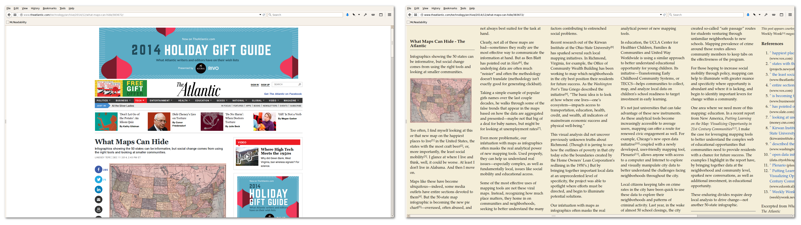

# McReadability

McReadability is a multi-column version of [Arc90's Readability bookmarklet](http://lab.arc90.com/experiments/readability/). The original Readability is now defunct, but you can still use this version. McReadability reformats page text in constant-height columns. You scroll horizontally.

Visit [**anoved.github.io/mcreadability**](http://anoved.github.io/mcreadability/) to set up your own McReadability bookmarklet.
